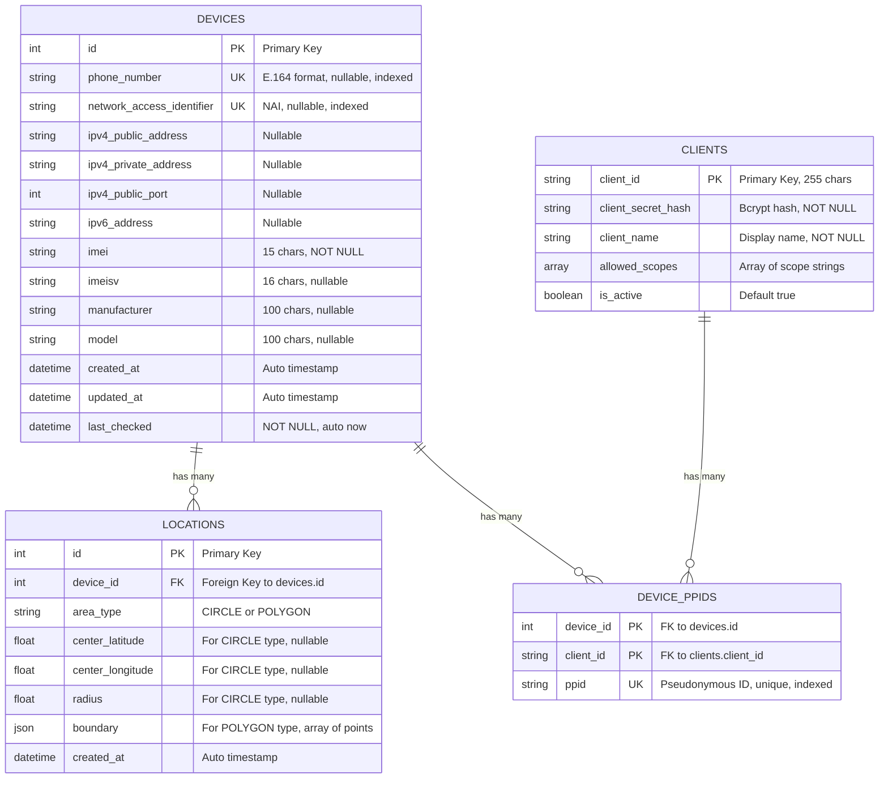

# CamaraPSAP Database Schema

## Entity Relationship Diagram



## Table Descriptions

### DEVICES
**Purpose**: Stores device information and identifiers for mobile devices.

**Key Features**:
- Multiple identifier types (phone, NAI, IPv4/IPv6)
- IMEI-based device identification
- Computed property: `tac` (Type Allocation Code - first 8 digits of IMEI)
- Cascading deletes to locations and PPIDs

**Indexes**:
- `id` (Primary Key)
- `phone_number` (Unique, indexed)
- `network_access_identifier` (Unique, indexed)

---

### LOCATIONS
**Purpose**: Stores geographical location data for devices.

**Key Features**:
- Supports two area types: CIRCLE and POLYGON
- Circle: defined by center coordinates (lat/long) and radius
- Polygon: defined by JSON array of coordinate points
- One-to-many relationship with devices (device can have multiple location records)
- Cascading deletes from parent device

**Indexes**:
- `id` (Primary Key)
- `device_id` (Foreign Key, indexed)

---

### CLIENTS
**Purpose**: OAuth 2.0 client applications that can access the API.

**Key Features**:
- Client credentials stored with bcrypt-hashed secrets
- Scope-based authorization (array of allowed scopes)
- Active/inactive status flag
- Each client can have unique PPIDs for multiple devices

**Indexes**:
- `client_id` (Primary Key, indexed)

---

### DEVICE_PPIDS (Junction Table)
**Purpose**: Links devices to clients with pseudonymous identifiers.

**Key Features**:
- Composite primary key (device_id + client_id)
- Each device-client pair has a unique PPID
- PPIDs are pseudonymous - don't expose sensitive device identifiers
- Allows clients to reference devices without seeing phone numbers or IMEI
- Cascading deletes from both parent tables

**Indexes**:
- `(device_id, client_id)` (Composite Primary Key)
- `ppid` (Unique, indexed)

---

## Relationships

### Device → Locations (One-to-Many)
- **Type**: One device can have multiple location records
- **Cascade**: DELETE - when device is deleted, all its locations are deleted
- **Use Case**: Track device location history or multiple location types

### Device → DevicePPIDs (One-to-Many)
- **Type**: One device can have PPIDs for multiple clients
- **Cascade**: DELETE - when device is deleted, all its PPIDs are deleted
- **Use Case**: Each client gets their own unique pseudonymous identifier for the device

### Client → DevicePPIDs (One-to-Many)
- **Type**: One client can have PPIDs for multiple devices
- **Cascade**: DELETE - when client is deleted, all its PPIDs are deleted
- **Use Case**: Client can access multiple devices with unique PPIDs for each

---

## Security & Privacy Features

1. **Pseudonymous Identifiers (PPIDs)**:
   - Each client-device pair has a unique PPID
   - Clients reference devices by PPID instead of sensitive identifiers
   - Prevents cross-client tracking

2. **Hashed Credentials**:
   - Client secrets stored as bcrypt hashes
   - Password hashing prevents secret exposure even with database access

3. **Scope-Based Authorization**:
   - Clients only get scopes they're authorized for
   - Fine-grained access control per API operation

---

## Sample Queries

### Get device with all locations
```sql
SELECT d.*, l.*
FROM devices d
LEFT JOIN locations l ON d.id = l.device_id
WHERE d.phone_number = '+1234567890';
```

### Get PPID for a device-client pair
```sql
SELECT ppid
FROM device_ppids
WHERE device_id = 1 AND client_id = 'test_client';
```

### Get all devices a client has access to
```sql
SELECT d.*
FROM devices d
INNER JOIN device_ppids dp ON d.id = dp.device_id
WHERE dp.client_id = 'test_client';
```

### Get active clients with specific scope
```sql
SELECT *
FROM clients
WHERE is_active = true
  AND 'device-identifier:retrieve-identifier' = ANY(allowed_scopes);
```
